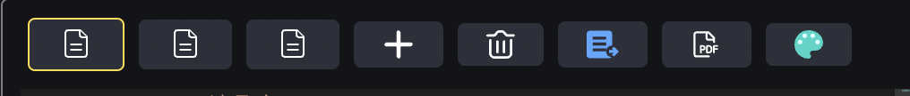

<h1 align="center">

  <br>
  <a href="https://dandandq.github.io/resume/" target="_blank">Resume</a>
  </br>
</h1>

## 1 项目简介


一个使用 yaml 配置生成简历的项目。其功能点主要包括：
- 使用 yaml 文件配置简历内容
- 支持多个配置文件，且会保存所有配置文件内容至 localstorage
- 实时预览简历最终样式
- 美观的简历界面（ps:简历排版目前较单一，后续会考虑增加新的排版方式，或者加入可视化的排版功能)
- 支持导出为 pdf

## 2 使用文档


### 使用示例
访问 <a href="https://dandandq.github.io/resume/" target="_blank">Resume</a>


### 操作按键和快捷键介绍




页面左侧上方为操作按钮区域。


- 不同的简历配置页，点击即在左侧编辑区加载对应的 yaml 配置
  


- 新建简历配置页


- 删除当前简历配置页（当只有一项时不允许删除）


- 根据左侧内容，生成右侧简历预览


- 将右侧预览区导出为 pdf


- 切换右侧简历样式


注意事项：
- 每次刷新页面前，都会保存当前所有的简历配置页，下次刷新还是一样的内容！
- 按钮5的等效快捷键为 enter，一般鼠标焦点需要不在编辑器内才能生效
- 每次新建简历配置页，都会有默认的配置项，按一下保存按钮就能在右侧生成内容较为饱满的简历了
- 由于 html2canvas 导出图片时，存在 css 属性不支持、字体模糊的问题，可以直接在网页上右键选择打印，在打印页面的「更多设置」中，将缩放调至150，打印即可。（以chrome为例，缩放比例自行调整）
### yaml 配置文件格式说明

在简历配置页的初始值上删改，就可以快速生成简历啦，其中有用的key，都是英文的，需要的配置项就保留，不需要的直接删除。已有的 key 列举如下:
- name: 填写名字
- infos: 填个人基本信息，是一个数组，数组每一项是一个对象
- contact: 一个对象，包含四个key，分别是：
  - wechat 微信
  - phone 电话号码
  - email 邮箱
  - github github链接，这里是可点击访问的
- skills：个人技能，是个数组。数组每一项是个对象，包含 name 和 level，表示技能名称和掌握程度。
- CARD-开头的：识别为右侧的一个卡片，是一个数组，每一项包括 name，time，decs 三个 key。
  - name：表示对应的名称
  - time：表示时间，将出现在 name 的右侧
  - desc：相关的详细描述，支持文本和文本数组形式

```yaml
name: 填名字

infos: 
  - xxx: xxx
  - xxx: xxx

contact:
  phone: 填电话
  email: 填邮箱
  wechat: 填微信
  github: 填github

skills:
- name: JavaScript
  level: 75
- name: HTML5
  level: 75

CARD-xx经历（识别开头是CARD-的）:
- name: 大标题
  time: 时间时间时间
  desc:
   - 描述1: xxx
   - 描述2: xxx
```

简单说明一下 yaml 格式的文件。'- ' 开头表示数组的某一项， 而 'xx: xxx' 则是典型的 key: value 组合。上述配置将转化为以下 json 文件：
```json
{
    "name": "填名字",
    "infos": [
        {
            "xxx": "xxx"
        },
        {
            "xxx": "xxx"
        }
    ],
    "contact": {
        "phone": "填电话",
        "email": "填邮箱",
        "wechat": "填微信",
        "github": "填github"
    },
    "skills": [
        {
            "name": "JavaScript",
            "level": 75
        },
        {
            "name": "HTML5",
            "level": 75
        },
    ],
    "CARD-xx经历（识别开头是CARD-的）": [
        {
            "name": "大标题",
            "time": "时间时间时间",
            "desc": [
                {
                    "描述1": "xxx"
                },
                {
                    "描述2": "xxx"
                }
            ]
        },
    ],
}
```


## 3 开发文档


```shell
yarn install
yarn dev
```

部署到github pages：
修改 deploy.sh 文件里部署的仓库地址和分支
然后执行
```shell
yarn deploy
```


### 技术要点

##### yaml 转 json
yaml 主要用过换行和缩进来区分不同类型的数据
使用 js-yaml 库进行数据转换

```js
import yaml from 'js-yaml';
const jsonFormat = yaml.load(yamlFormat)
```

##### monaco编辑器使用

调用 api，传入配置生成编辑器界面。
```js
import * as monaco from 'monaco-editor'
this.editor = monaco.editor.create(document.getElementById('container'), {
      value: '', // yaml 文本的值
      language: 'yaml', // 这里选定语言为 yaml
      lineNumbers: 'on',
      roundedSelection: false,
      scrollBeyondLastLine: false,
      readOnly: false,
      theme: 'vs-dark',
      formatOnPaste: true,
      automaticLayout: true,
      wordWrap: 'on',
    });
// 窗口缩放时编辑器也能自适应大小
window.addEventListener('resize', () => {
  toRaw(this.editor).layout() // toRaw 是因为 vue3 将 data 都转为响应式了，需要恢复为非响应式
})
```

### 支持多样式快速开发
/src/components/templates 文件夹存放简历样式模板，通过脚本扫描该文件夹，并作为异步组件挂载。

```js
// 扫描文件夹
import { defineAsyncComponent } from 'vue'

// 导出组件列表，并注册异步组件
const files = import.meta.glob("/src/components/templates/*.vue")
const comList = []
const components = {}

Object.keys(files).map((file) => {
  const comName = file.slice(26, -4)
  comList.push(comName)
  components[comName] = defineAsyncComponent({
    loader: files[file]
  })
})

export { comList, components } 
```

```html
// 挂载组件，并实现异步、动态加载组件
<component :is="comName"></component>
```
```js
export dafault {
  components,
  data() {
    return {
      comList: comList,
      comIdx: 0,
      comName: 'PreviewTemplate01'
    }
  },
  methods: {
    onChangePreview() {
      this.comIdx = (this.comIdx + 1) % this.comList.length
      this.comName = this.comList[this.comIdx]
    }
  }
}

```
## 4 功能 List

- [x] 编辑器界面
- [x] 简历信息模块：姓名，基本信息，联系方式，技能列表
- [x] 简历项目模块
- [x] 简历头像上传
- [x] 工具栏：增加，下一个，删除，
- [x] 根据 yaml 文件生成简历配置 json
- [x] 简历导出功能
- [x] 更多简历排版方式
- [ ] 简历各个模块支持切换样式，比如skills模块，项目详情模块，各种小logo支持切换
- [ ] 移动端导出功能
- [ ] 各个模块支持拖拽调整等？
- [ ] 支持在页面上更换配色

## 5 License

[MIT](https://opensource.org/licenses/MIT)